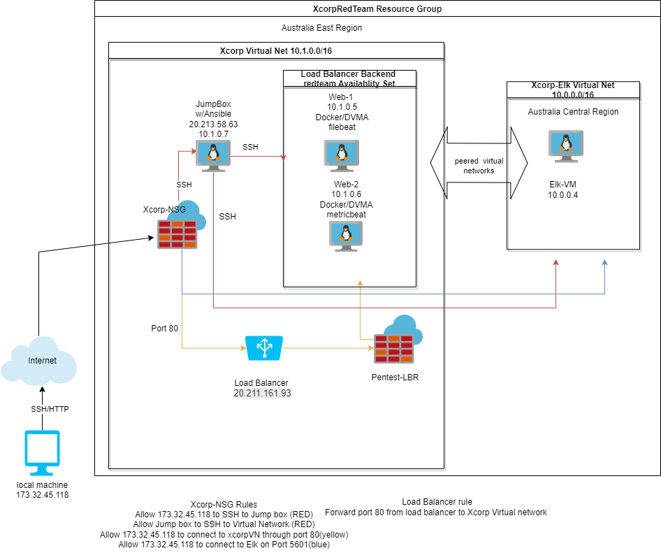

# Rekt-Repo
Cyber security repo tracking my journey 
## Automated ELK Stack Deployment

The files in this repository were used to configure the network depicted below.

These files have been tested and used to generate a live ELK deployment on Azure. They can be used to either recreate the entire deployment pictured above. Alternatively, select portions of the Yaml file may be used to install only certain pieces of it, such as Filebeat.

  - install-elk.yml

This document contains the following details:
- Description of the Topologu
- Access Policies
- ELK Configuration
  - Beats in Use
  - Machines Being Monitored
- How to Use the Ansible Build

### Description of the Topology

The main purpose of this network is to expose a load-balanced and monitored instance of DVWA, the D*mn Vulnerable Web Application.

Load balancing ensures that the application will be highly robust, in addition to restricting access to the network.
- _TODO: What aspect of security do load balancers protect?Load balancers are important beacuse they help protect the avalibilty of your systems. What is the advantage of a jump box? Jump boxes are important as the can limit access to your network. 

Integrating an ELK server allows users to easily monitor the vulnerable VMs for changes to the Logs and system Resources.
- _TODO: What does Filebeat watch for? Filebeat monitors logfiles
- _TODO: What does Metricbeat record? Metricbeat records the state of the system and its resources

The configuration details of each machine may be found below.
_Note: Use the [Markdown Table Generator](http://www.tablesgenerator.com/markdown_tables) to add/remove values from the table_.

| Name     | Function | IP Address | Operating System |
|----------|----------|------------|------------------|
| Jump Box | Gateway  | 10.1.0.7   | Linux            |
| Web-1    |  DVWA    | 10.1.0.5   | Linux            |
| Web-2    |  DVWA    | 10.1.0.6   | Linux            |
| Elk-VM   |Elk stack | 10.0.0.4   | Linux            |

### Access Policies

The machines on the internal network are not exposed to the public Internet. 

Only the Jump Box machine can accept connections from the Internet. Access to this machine is only allowed from the following IP addresses:
- _TODO: Add whitelisted IP addresses_ 173.32.45.118

Machines within the network can only be accessed by SHH via the jump box.
- _TODO: Which machine did you allow to access your ELK VM?Local Host What was its IP address? Access was allowed from my Public IP address

A summary of the access policies in place can be found in the table below.

| Name     | Publicly Accessible | Allowed IP Addresses |
|----------|---------------------|----------------------|
| Jump Box | Yes                 | 173.32.45.118         |
| VNet     | No                  |   10.1.0.7           |
| Elk      | Yes                 |   173.32.45.118       |

### Elk Configuration

Ansible was used to automate configuration of the ELK machine. No configuration was performed manually, which is advantageous because...
- _TODO: What is the main advantage of automating configuration with Ansible?The advantage of automating is that u can easily replicate the task and reduce human error

The playbook implements the following tasks:
- _TODO: In 3-5 bullets, explain the steps of the ELK installation play. E.g., install Docker; download image; etc._
- ...Install Docker.io
- ...Install python3-pip
- ...Install Docker module
_ ...Increase virtual memory so the Elk server can run
- ...Download and launch docker elk container
- ...Add ports for Elk

The following screenshot displays the result of running `docker ps` after successfully configuring the ELK instance.

![TODO: Update the path with the name of your screenshot of docker ps output] Images/Docker ps.png

### Target Machines & Beats
This ELK server is configured to monitor the following machines:
- _TODO: List the IP addresses of the machines you are monitoring_Web 1 10.1.0.5, Web 2 10.1.0.6

We have installed the following Beats on these machines:
- _TODO: Specify which Beats you successfully installed_ Filebeat and Metricbeat were both Installed successfully

These Beats allow us to collect the following information from each machine:
- _TODO: In 1-2 sentences, explain what kind of data each beat collects, and provide 1 example of what you expect to see. E.g., `Winlogbeat` collects Windows logs, which we use to track user logon events, etc. Filebeat collects Logfiles like syslog.  Metricbeat collets System infomation, like what Resources are being used by the system and how much the resources are taxing the system. 

### Using the Playbook
In order to use the playbook, you will need to have an Ansible control node already configured. Assuming you have such a control node provisioned: 

SSH into the control node and follow the steps below:
- Copy the filebeat configuration file to the ansible container.
- Update the hosts file to include...the IP address of the machine you are setting up with playbook
- Run the playbook, and navigate to machine you just setup to check that the installation worked as expected.

_TODO: Answer the following questions to fill in the blanks:_
- _Which file is the playbook? filebeat-playbook.yml Where do you copy it?_You copy the playbook to the VM you are setting up filebeat on. 
- _Which file do you update to make Ansible run the playbook on a specific machine? you must update the hosts file to run playbook on specific machines. 
How do I specify which machine to install the ELK server on versus which to install Filebeat on? In your Playbook you specify on the hosts line what group that machine is in. Elk server is in the elk group. The Filebeat is the webservers group 
- _Which URL do you navigate to in order to check that the ELK server is running? http://[your.VM.IP]:5601/app/kibana.

_As a **Bonus**, provide the specific commands the user will need to run to download the playbook, update the files, etc._
command to download the elk playbook. {ansible-playbook install-elk.yml}
command to check elk container up and running. {ssh user@elkvmIP} then run {docker ps} you should see container is up and running. Then you will go to Azure and set up access rules. 
navigate to  http://[your.VM.IP]:5601/app/kibana. to check that ELK is up and running
Installation of filebeat. 
ssh into jump box. 
command to start ansible container docker start (container name)
command to attach to container. docker attach (container name)
command to download filebeat. curl https://gist.githubusercontent.com/slape/5cc350109583af6cbe577bbcc0710c93/raw/eca603b72586fbe148c11f9c87bf96a63cb25760/Filebeat > /etc/ansible/filebeat-config.yml
Edit the Config file. Scroll to line #1106 and replace the IP address with the IP address of your ELK machine. 
Scroll to line #1806 and replace the IP address with the IP address of your ELK machine.
command to create filebeat playbook. nano filebeat-playbook.yml
move file to /etc/ansible/roles/
after finished creating playbook save and run to install filebeat.
command to install filebeat {ansible-play filebeat-playbook.yml}
check installation was success by navigating to Filebeat installation page on elk server.
on the bottom of page click check data button. the button should turn green. 
you can install Metricbeat following the same commands just using metricbeat files. 
